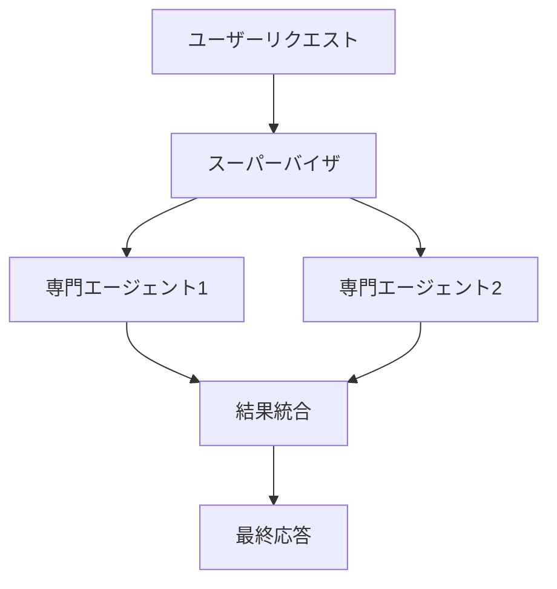

## 🌟 はじめに

[おぐま](https://github.com/9mak)です。
AWSのAmazon Bedrockの**単体エージェント機能**と**マルチエージェントコラボレーション機能**の2つの機能には明確な違いがあり、それぞれの適用シナリオや利点も異なります。本記事では、この違いをわかりやすく解説します。

## ✅ 主なポイント

1. **単体エージェント機能**: 単一のAIエージェントがユーザーリクエストを処理。
2. **マルチエージェントコラボレーション機能**: 複数の専門エージェントが協調して複雑なタスクを解決。
3. **適用シナリオの違い**: 単純なタスクには単体エージェント、複雑なタスクにはマルチエージェントが適している。

## 🔍 詳細分析

### 単体エージェント機能とは？

単体エージェントは、1つのAIモデルまたはアクショングループを活用してユーザーリクエストに応答します。この機能は以下の場合に適しています。

- シンプルなタスク（例：FAQ応答や予約管理）
- リアルタイム性が求められる場面
- 設定や運用が簡単であることが重要な場合

#### 主な特徴

- **簡易性**: 設定が容易で、迅速に導入可能。
- **単一責任モデル**: エージェントが全てのタスクを自律的に処理。
- **低レイテンシー**: タスク分解や他エージェントとの通信が不要。

### マルチエージェントコラボレーション機能とは？

マルチエージェントコラボレーションでは、複数の専門エージェントが協力し、スーパーバイザ（Supervisor）による調整のもとでタスクを遂行します。
このアプローチは以下の場合に有効です。

- 複雑で多段階にわたるタスク
- 各タスクに専門性が求められる場合
- 並列処理による効率向上が必要な場合

#### 主な特徴

- **スーパーバイザモデル**: スーパーバイザがタスクを分解し、各専門エージェントに委任。
- **並列処理**: 複数のタスクを同時進行で処理可能。
- **柔軟性**: 新たな専門エージェントを容易に追加可能。

### 技術的影響

#### 単体 vs マルチ

| 特徴 | 単体エージェント | マルチエージェント |
| --- | --- | --- |
| 設定難易度 | 低い | 高い |
| 処理速度 | 高速（単純タスク） | 高速（並列処理） |
| 適応性 | 限定的 | 高い |

:::message alert
実際にマルチエージェントコラボレーションで設定してクエリしてみましたが、単純に並列処理だから早いってことにはならなそうです。
コラボレーション設定している各モデルの精度/回答速度が大きく影響します。
:::

## 🎉 まとめ

AWS Bedrockの単体およびマルチエージェント機能は、それぞれ異なるニーズに対応する強力なツールです。シンプルなユースケースには単体エージェント、大規模で複雑なプロジェクトにはマルチエージェントコラボレーションが最適です。

## 💡 補足

用語解説

- **スーパーバイザ（Supervisor）**: マルチエージェントシステム全体を管理する役割。
- **アクショングループ**: 特定タスク実行用に事前定義されたLambda関数群。
- **ナレッジベース**: エージェントが参照する情報データベース。
