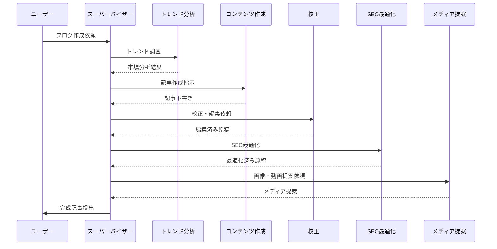
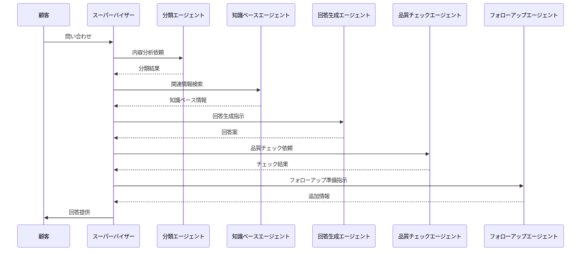
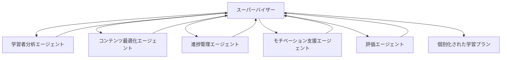

## はじめに

[おぐま](https://github.com/9mak)です。

2024年12月3日にAWSから発表されたBedrock Multi-Agent Collaboration機能について、実践的な活用アイデアをご紹介します。この機能は、複数のAIエージェントの協調作業をマネージドサービスとして提供する画期的なものです。

## 従来の課題と新機能の特徴

### 従来の課題

- エージェントの再利用性が限定的
- 複雑なタスクでのエラー処理が煩雑
- エージェント間の連携における監視が困難

これまでは、エージェントの専門性を高めると再利用が難しく、汎用性を持たせると処理が遅くなるというトレードオフがありました。

### Multi-Agent Collaborationの革新性

- スーパーバイザーエージェントによる効率的なタスク管理
- エージェント間のシームレスな情報交換
- 柔軟なスケーリングとエラー処理

## 革新的な活用パターン

### 1. ブログ自動作成システム

- **トレンド分析エージェント**: 市場動向とキーワード分析
- **コンテンツ作成エージェント**: 記事の構成と執筆
- **校正エージェント**: 文章校正と品質管理
- **SEO最適化エージェント**: 検索エンジン対策
- **メディア提案エージェント**: 画像・動画の提案

### 2. インテリジェント問い合わせ回答システム

- **分類エージェント**: 問い合わせ内容の分析と優先度付け
- **知識ベースエージェント**: 関連情報の検索と抽出
- **回答生成エージェント**: 顧客に最適化された回答作成
- **品質チェックエージェント**: 回答の正確性と一貫性の確認
- **フォローアップエージェント**: 追加質問の予測と事前準備

### 3. 教育パーソナライゼーション

- **学習者分析エージェント**: 学習スタイルと理解度の把握
- **コンテンツ最適化エージェント**: パーソナライズされた教材選択
- **進捗管理エージェント**: 学習状況の追跡と分析
- **モチベーション支援エージェント**: 学習意欲の維持と向上
- **評価エージェント**: 理解度の確認とフィードバック

## 運用のポイント

### スーパーバイザーエージェントの役割

1. タスクの適切な分解と割り当て
2. エージェント間の連携管理
3. 結果の統合と品質確保
4. エラー発生時の適切な対応

### 注意点

- エージェント数は必要最小限に抑える
- タスクの依存関係を明確にする
- エラー時のフォールバック策を用意する

## まとめ

Bedrock Multi-Agent Collaboration機能は、複雑なAIシステムの実装を大幅に簡素化します。適切な設計と運用により、より高度で信頼性の高いAIソリューションが実現可能です。

現在はプレビュー段階ですが、今後のアップデートでさらなる機能拡張が期待されます。

## 参考リンク

- [AWS公式ブログ](https://aws.amazon.com/jp/blogs/news/introducing-multi-agent-collaboration-capability-for-amazon-bedrock/)
- [AWSドキュメント](https://docs.aws.amazon.com/bedrock/)

この新機能を活用して、皆さんもぜひ革新的なAIソリューションにチャレンジしてみてください！
