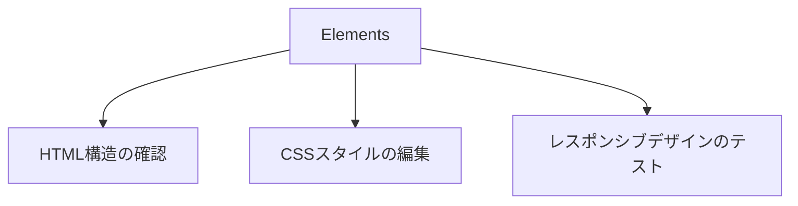
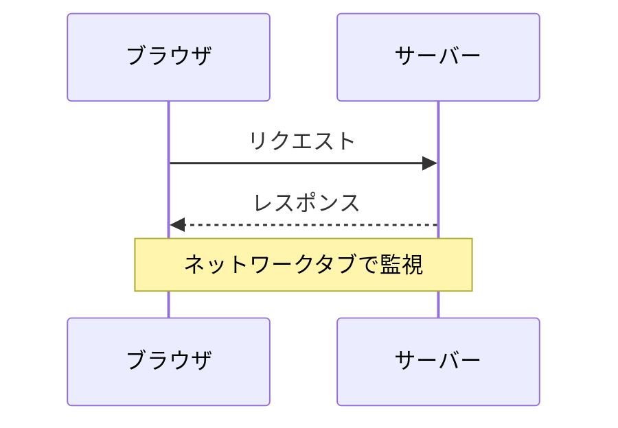

## 🌟 はじめに

[おぐま](https://github.com/9mak)です。

今回は、Webデベロッパーにとって必須のツールである「Chrome開発者ツール」（DevTools）について、その基本的な機能と活用方法をご紹介します。
このツールを使いこなすことでWeb開発の効率が大幅に向上し、デバッグや最適化が格段に容易になります。

:::message
自身はWebデベロッパーではないものの開発者ツールをよく使うので、普段使わないものに関しても調べてみたく網羅的な解説記事にしました。
:::

## 🔍 開発者ツールの主要機能

### 1. Elements（要素）タブ



- HTML構造のリアルタイム確認と編集
- CSSスタイルのライブ編集とデバッグ
- デバイスエミュレーションによるレスポンシブデザインのテスト

### 2. Console（コンソール）タブ

- JavaScriptのデバッグと実行
- エラーメッセージの確認
- `console.log()`などを使用したデバッグ情報の出力

### 3. Sources（ソース）タブ

- JavaScriptのブレークポイント設定とステップ実行
- ローカルオーバーライドによるファイル編集
- スニペットの作成と実行

### 4. Network（ネットワーク）タブ



- HTTP/HTTPS通信の詳細分析
- リクエスト/レスポンスヘッダーの確認
- ネットワーク速度のシミュレーション

### 5. Performance（パフォーマンス）タブ

- ページ読み込み時間の分析
- JavaScript実行時間の計測
- レンダリングパフォーマンスの最適化

### 6. Application（アプリケーション）タブ

- ローカルストレージとセッションストレージの管理
- Cookieの確認と編集
- サービスワーカーの管理

## 💡 効果的な活用テクニック

### 1. ブレークポイントを活用したデバッグ

```javascript
function calculateTotal(price, quantity) {
    let total = price * quantity;
    // ここにブレークポイントを設定
    return total;
}
```

Sourcesタブでブレークポイントを設定し、変数の値をステップバイステップで確認できます。

### 2. モバイルデバイスのエミュレーション

Elementsタブ上部のデバイスツールバーを使用して、様々なモバイルデバイスでのレイアウトをテストできます。

### 3. ネットワークスロットリング

Networkタブでネットワーク速度を制限し、低速環境でのパフォーマンスをテストします。

### 4. パフォーマンス分析


Performanceタブを使用して、ページの読み込みやユーザーインタラクションのパフォーマンスを詳細に分析できます。

## 🎯 開発者ツール活用のポイント

1. ショートカットキーの習得
   - Mac: `Cmd + Option + I`
   - Windows/Linux: `Ctrl + Shift + I`

2. コンソールを効果的に使用
   - `console.table()`でデータを見やすく表示
   - `console.time()`と`console.timeEnd()`で処理時間を計測

3. ネットワークリクエストのフィルタリング
   - Networkタブで特定のファイルタイプやドメインに絞ってリクエストを確認

4. Lighthouseを活用したサイト分析
   - パフォーマンス、アクセシビリティ、SEOなどの総合的な評価を自動で行う

## 🎉 まとめ

Chrome開発者ツールは、Web開発者にとって強力な味方です。基本的な機能を押さえ、効果的な活用テクニックを身につけることで、開発効率が飛躍的に向上します。

今回紹介した機能は、開発者ツールの一部に過ぎません。実際に使いながら、自分のワークフローに合った使い方を見つけていくことをおすすめします。

## 📚 参考リンク

- [Chrome DevTools 公式ドキュメント](https://developer.chrome.com/docs/devtools/)
- [MDN Web Docs - 開発者ツール](https://developer.mozilla.org/ja/docs/Learn/Common_questions/What_are_browser_developer_tools)

Chrome開発者ツールを使いこなして、より効率的で高品質なWeb開発を実現しましょう！
