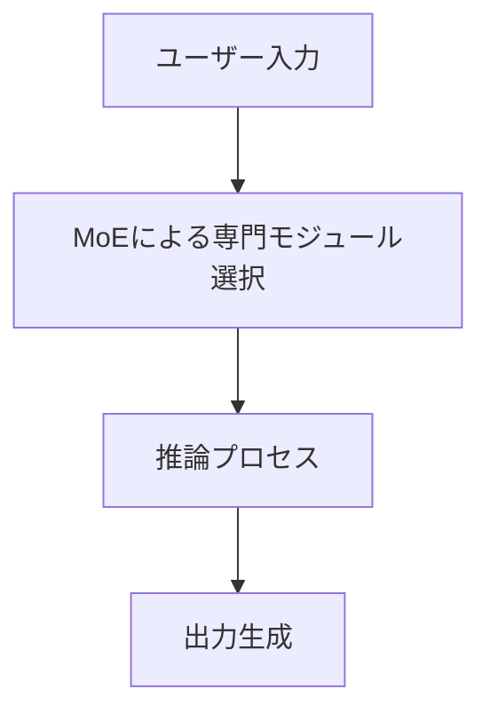

## 🌟 ニュース概要

[おぐま](https://github.com/9mak)です。
中国発のAI企業「DeepSeek」が開発した大規模言語モデル「DeepSeek-R1」が、AI業界で注目されています。高性能でありながら、開発コストや利用料金が低く抑えられており、さらにMITライセンスの下で自由に利用可能です。
このモデルは、OpenAIやAnthropicなど米国の競合企業に対抗する存在として注目されており、特にそのオープン性とコストパフォーマンスが際立っています。

:::message
この記事は2025年2月9日時点の情報に基づいています。最新情報は公式発表をご確認ください。
:::

## ✅ 主なポイント

1. **DeepSeek-R1の特徴**:
   - 高性能（OpenAIの「o1」に匹敵）でありながら、APIコストは数十分の1。
   - MITライセンスで提供され、オープンソースとして利用可能。
2. **競合他社との違い**:
   - アメリカ製モデル（GPT-4oやClaude）と比較してコスト効率が非常に高い。
   - モデル自体をダウンロードしてローカル環境で使用可能。

## 🔍 詳細分析

### 技術的特徴とアーキテクチャ

DeepSeek-R1は、「Mixture-of-Experts（MoE）」アーキテクチャを採用しており、必要な専門モジュールのみを活用することで効率的なリソース利用を実現しています。
この設計により、以下のような利点があります。

- **高い推論能力**: 特に数学的問題解決やプログラミングタスクで優れた性能を発揮。
- **長文コンテキスト処理**: 最大128,000トークンまで対応可能。
- **多言語対応**: 中国語と英語で特に強力なパフォーマンス。

さらに、2025年1月には画像生成にも対応するマルチモーダルモデル「Janus-Pro-1B」も公開されており、ビジュアルデータ処理にも対応可能となっています。

### 他社モデルとの比較

| 特徴 | DeepSeek-R1 | GPT-4o | Claude 3.5 |
| --- | --- | --- | --- |
| コスト効率 | 非常に高い | 中程度 | 中程度 |
| 推論能力 | 数学・プログラミングに強い | 汎用性が高い | 会話型タスクに強い |
| オープンソース | あり | なし | なし |
| マルチモーダル対応 | 制限あり（テキスト中心） | あり（画像・音声含む） | 制限あり |

DeepSeek-R1は特定分野での精度と効率性に焦点を当てており、高度な専門タスクには最適ですが、汎用性ではGPT-4oやClaudeに劣る部分もあります。

### 社会的・経済的影響

DeepSeekは低コストで高性能なAI技術を提供することで、小規模企業や学術機関にも高度なAI技術へのアクセスを可能にしました。この動きは以下のような影響をもたらしています：

| 分野 | 影響 |
| --- | --- |
| 教育 | 個別学習プラン作成や教育リソース最適化 |
| 医療 | データ解析による診断精度向上 |
| 金融 | リスク評価や市場予測への応用 |

:::message alert
一方で、中国製モデルという特性上、政治的制約やデータセキュリティへの懸念も指摘されています。
:::

## 🎉 まとめ

DeepSeek-R1は、高度な推論能力とコスト効率性を兼ね備えた画期的なAIモデルです。
そのオープンソース性と柔軟なカスタマイズ機能は、多くのユーザーに新たな可能性を提供します。
一方で、中国発という背景による課題も存在しますが日本企業などによるローカライズや追加学習が進むことで、その弱点も克服されると思います。

:::message
今後もDeepSeekの進化と、それが業界全体にもたらす影響について注目していきましょう。
:::

## 💡 補足

- **補足1**: DeepSeek-R1はMITライセンスで提供されており、商業利用も可能です。
- **補足2**: 米国市場ではデータセキュリティへの懸念が一部指摘されています。

:::details 用語解説

- Mixture-of-Experts (MoE): モデル内で専門分野ごとの小規模モジュールを活用するアーキテクチャ。
- 蒸留モデル (Distillation): 大規模モデルから小規模モデルへ知識を圧縮する技術。
- トークン: AIモデルが処理する最小単位（単語や文字列）。

:::

## 📚 参考URL

- [話題の中国発AI「DeepSeek」はAIのゲームチェンジャーになるのか](https://www.watch.impress.co.jp/docs/news/1658120.html)
- [PerplexityがDeepSeekを統合、透明性の高い検索が可能に](https://news.yahoo.co.jp/articles/82f270636449a9c8cdeec6c895b6a1af1e283fae)
