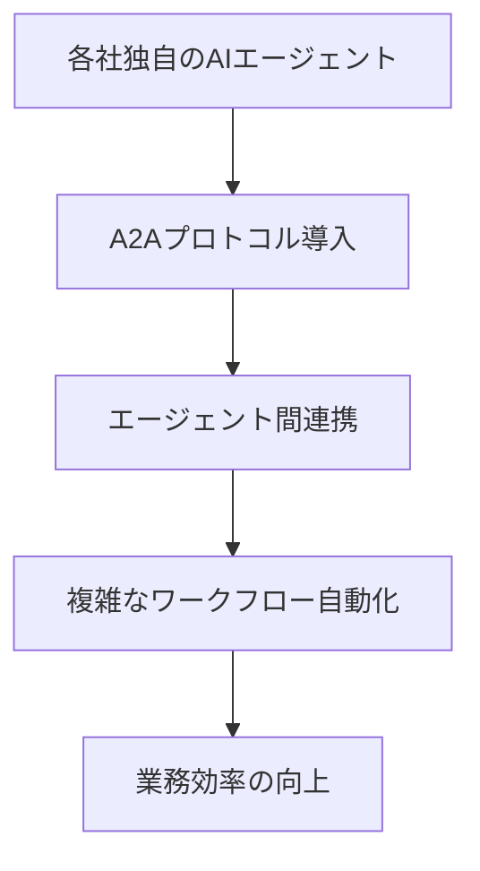

## 🌟 ニュース概要

[おぐま](https://github.com/9mak)です。  
Google Cloud Next '25で発表された「Agent2Agent（A2A）プロトコル」に、ServiceNowが対応予定であることが公表されました。A2Aプロトコルは、異なるAIエージェント同士の連携を容易にすることを目的としたオープン標準です。

:::message
この記事は2025年5月時点の情報に基づいています。最新の情報は公式発表をご確認ください。
:::

## ✅ 主なポイント

1. **A2Aプロトコルとは**: Googleが主導し、50社以上の技術企業が参加するAIエージェント間連携のための新しい標準
2. **ServiceNowの対応予定**: 2025年後半にServiceNowのAI Agent OrchestratorがA2Aプロトコルに対応予定
3. **AIエージェント連携の意義**: 異なるベンダーのAIソリューション間での連携が容易になり、企業のAI活用範囲が広がる

## 🔍 詳細分析

Agent2Agent（A2A）プロトコルは、2025年4月9日にGoogle Cloud Next '25で発表されたオープン標準です。  
このプロトコルは、異なるベンダーのAIエージェントが相互に通信し、情報共有やタスクの調整を行えるようにすることを目的としています。ServiceNowを含む50社以上のテクノロジーパートナー（Atlassian、Box、Cohere、Intuit、Langchain、MongoDB、PayPal、Salesforce、SAPなど）が開発に参加しています。

### 技術的影響

A2Aプロトコルは、AIエージェント間の相互運用性を高めるための技術基盤を提供します。

A2Aプロトコルの主な技術的特徴：

1. **機能のディスカバリ**: エージェントはJSON形式の「Agent Card」で自身の機能を公開し、クライアントエージェントが最適なパートナーを特定可能
2. **タスク管理**: クライアントとリモートエージェント間のやり取りはタスク単位で行い、定義されたライフサイクルを持つ
3. **標準技術の活用**: HTTP、Server-Sent Events、JSON-RPCなど既存の標準技術を利用し、IT環境との統合がしやすい
4. **セキュリティ機能**: 認証・認可などエンタープライズ向けのセキュリティをサポート

ServiceNowは2025年後半にAI Agent OrchestratorでA2Aプロトコル対応を予定しています。これにより、ServiceNowのエージェントと他社のエージェントの連携が技術的に容易になります。

### 社会的影響

A2AプロトコルによるAIエージェント間の標準化された通信は、企業のAI活用の幅を広げる可能性があります。  
従来は、AIエージェントは単一ベンダーやプラットフォーム内での連携が中心でしたが、A2Aプロトコルの導入により、異なるシステム間での連携が現実的になります。  
例えば、複数部門にまたがる業務プロセスや、他社サービスとの連携が必要な業務でも、AIエージェント同士が協力して処理できるようになることが期待されています。

### 経済的影響

A2Aプロトコルの導入は、企業のAI導入や運用コスト、業務効率に影響を与えると考えられます。

| 分野 | 予測される影響 |
| --- | --- |
| 導入コスト | ベンダーロックインの緩和により、複数のAIソリューションを柔軟に選択・導入しやすくなる |
| 運用効率 | システム間連携の自動化により、人的リソースの削減や業務効率化が期待できる |
| イノベーション | 複数AIの組み合わせによる新たな業務プロセスやサービスの創出が見込まれる |

ServiceNowのAI Agent Orchestratorは、特化型AIエージェントとサードパーティ製AIエージェントの連携を支援する機能を持っています。A2A対応により、これらの機能がさらに拡張される見込みです。

## 🎉 まとめ

ServiceNowのA2Aプロトコル対応は、AIエージェント間の連携を強化するための取り組みの一つです。  
2025年後半にはAI Agent OrchestratorのA2A対応が予定されており、異なるベンダーのAIエージェント同士の連携や業務自動化が進むことが期待されます。

A2Aプロトコルの標準化により、企業は複数のAIソリューションを組み合わせて活用しやすくなります。今後のServiceNowおよびA2Aプロトコルの動向に注目が必要です。

:::message alert
A2Aプロトコルは現在開発段階であり、仕様や提供時期は今後変更される可能性があります。最新情報は公式発表をご確認ください。
:::

## 💡 補足

- **ServiceNowのAIエージェント関連製品**: 2025年1月29日に発表されたAI Agent Orchestrator、事前構築済みAIエージェント、AI Agent Studioは、企業のAI活用を支援するためのソリューションです
- **MCPとの関係**: A2AはAnthropic社のModel Context Protocol（MCP）を補完するプロトコルとして位置づけられています
- **日本企業への影響**: グローバル標準となることが予想されるA2Aプロトコルへの対応は、日本企業のAI活用戦略にも影響を与える可能性があります

:::details 用語解説

- **A2A（Agent2Agent）**: 異なるAIエージェント間の相互通信を可能にするオープンプロトコル
- **AIエージェント**: 特定のタスクを自律的に実行するAIシステム
- **MCP（Model Context Protocol）**: Anthropic社が提案するAIモデルのコンテキスト管理プロトコル
- **Agent Card**: AIエージェントが提供する能力を記述したJSON形式の情報

:::

---

**参考リンク：**

1. [うさぎでもわかる ServiceNowのマルチエージェント - 海外事例と展望](https://zenn.dev/taku_sid/articles/20250411_servicenow_multiagent)
2. [ServiceNow | Integration for Customer Incident Management](https://www.seeburger.com/integration-marketplace/connectors/servicenow)
3. [うさぎでもわかるAgent2Agent - AIエージェント連携の新時代](https://zenn.dev/taku_sid/articles/20250410_agent2agent)
4. [AppDynamics と ServiceNow CMDB およびイベント管理との統合](https://docs.appdynamics.com/appd/23.x/latest/en/extend-appdynamics/integration-modules/integrate-appdynamics-with-servicenow-cmdb-and-event-management?scroll-translations%3Alanguage-key=ja)
5. [ServiceNow intros AI agent studio and orchestrator](https://www.techtarget.com/searchenterpriseai/news/366618614/ServiceNow-intros-AI-agent-studios-and-orchestrator)
6. [Agent2Agent プロトコル（A2A）を発表：エージェントの相互運用性の新時代](https://cloud.google.com/blog/ja/products/ai-machine-learning/a2a-a-new-era-of-agent-interoperability)
7. [ServiceNowの業務自動化AIエージェントについて - 木下寛士](https://note.com/hiroshikinoshita/n/n9cced9aa58a2)
8. [NEW! ServiceNow Google Agent to Agent A2A Protocol announced.](https://www.linkedin.com/posts/getsomeservicenow_new-servicenow-google-agent-to-agent-a2a-activity-7317281861364260864-idEK)
9. [A2A Protocol ServiceNow Implementation Guide - BytePlus](https://www.byteplus.com/en/topic/551374)
10. [Announcing the Agent2Agent Protocol (A2A)](https://developers.googleblog.com/en/a2a-a-new-era-of-agent-interoperability/)
