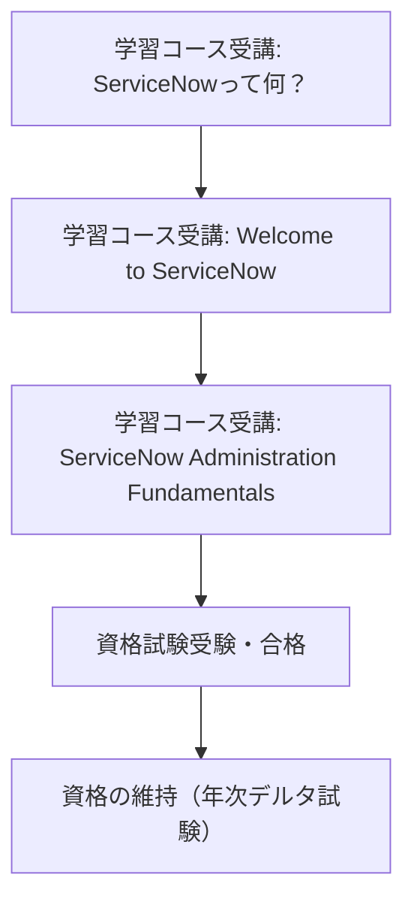

## 🌟 はじめに

[おぐま](https://github.com/9mak)です。
ServiceNowは企業のデジタルワークフローを自動化・最適化するクラウドプラットフォームとして世界中で採用が進んでいます。
本記事では、ServiceNowのエコシステムで価値を発揮するために必要な各種認定資格について包括的に解説します。

:::message
この記事は2025年5月6日時点での情報に基づいています。ServiceNowの認定プログラムは定期的に更新されるため、最新情報は公式サイトでご確認ください。
:::

## 概要

ServiceNowの認定資格についての主要な情報をまとめました：

1. **4つの認定タイプ**: ServiceNowの認定資格は、メインライン認定、エキスパートプログラム、マイクロ認定、アクレディテーションの4種類に分類されます
2. **階層構造**: 認定資格はキャリアパスに応じた階層構造になっており、CSA（Certified System Administrator）が基礎となっています
3. **継続的な学習**: 半年ごとのプラットフォームアップデートに合わせたデルタ試験により、認定資格の維持が必要です

## 📌 ServiceNowの認定資格体系

ServiceNowの認定資格は明確な体系に基づいており、技術者のスキルレベルやキャリアパスに応じて選択できるようになっています。

### 🗣️ 認定資格の4つの主要カテゴリー

ServiceNowの認定資格は以下の4つの主要カテゴリーに分類されます：

1. **メインライン認定資格（Mainline certifications）**
   - Now Platformの技術的知識とスキルを証明する正式な認定資格
   - 試験は監督付き（proctored）で技術的な内容
   - ServiceNowプラットフォームの主要製品をカバー

2. **エキスパートプログラム（Expert programs）**
   - CSAとCADを含む4〜5つのメインライン認定と3〜5年の経験が必要
   - 3〜6ヶ月の集中プログラムを経て認定される高度な資格
   - Certified Technical Architect (CTA)やCertified Master Architect (CMA)などが含まれる

3. **マイクロ認定資格（Micro-certifications）**
   - 監督なし（non-proctored）の試験、シミュレーターベースの試験など
   - 特定の機能領域に特化したより小規模な認定
   - Flow Designer、Service Portal、IntegrationHubなどの専門分野がある

4. **アクレディテーション（Accreditation）**
   - 主にServiceNowパートナー企業向けの認定
   - 業界別（ヘルスケア、通信、金融など）や製品別のセールス・プリセールス認定

:::details 認定資格の詳細リスト

- **メインライン認定資格**
  - Certified System Administrator (CSA)
  - Certified Application Developer (CAD)
  - Certified Implementation Specialist (CIS)シリーズ（ITSM, HR, Discovery, CSMなど多数）
  - Certified Application Specialist (CAS)シリーズ

- **エキスパートプログラム**
  - Certified Technical Architect (CTA)
  - Certified Master Architect (CMA)

- **マイクロ認定資格**
  - Flow Designer Fundamentals
  - Service Portal Fundamentals
  - IntegrationHub Fundamentals
  - Automated Test Framework
  - Predictive Intelligence
  - その他多数
:::

### 🌐 CSA（Certified System Administrator）：ServiceNowの入門資格

ServiceNow CSA（Certified System Administrator）は、ServiceNowエコシステムにおける最も基本的なメインライン資格です。この資格は他の多くの認定資格の前提条件となっており、ServiceNowの入門資格として位置づけられています。

CSA取得のためには以下のステップが必要です：

CSA資格取得の推奨経験として、以下が挙げられています：

- データベースの概念とシステム管理に関する業界経験
- ServiceNowインスタンスの使用や維持に関する3〜6か月間の経験

## ✅ 認定資格取得のプロセス

ServiceNowの認定資格を取得するための一般的なプロセスについて説明します。

| 時間 | 活動内容 |
| --- | --- |
| 準備段階 | 学習コース受講（必須または推奨）、個人学習 |
| 試験申込 | Now Learningから試験申込、試験バウチャー取得 |
| 試験受験 | オンライン監督付きまたは試験センターでの受験 |
| 資格維持 | 定期的なデルタ試験受験（半年または1年ごと） |

### 🗣️ 学習リソースについて

ServiceNow認定資格取得のための学習リソースには主に以下があります：

1. **Now Learning公式学習コース**
   - 各認定資格に必要なコースが設定されている
   - オンデマンドまたはインストラクター主導のコース形式

2. **Personal Developer Instance（PDI）**
   - 学習用の個人開発インスタンス
   - ハンズオン学習が可能

3. **ServiceNow公式ドキュメント**
   - 製品ドキュメントやガイド
   - 認定資格の詳細な試験仕様書

4. **コミュニティリソース**
   - ServiceNowコミュニティの質問回答
   - 学習グループへの参加

### 🌐 試験の種類と形式

ServiceNowの試験には以下の種類があります：

1. **メインライン試験**
   - 監督付きの正式な試験
   - オンラインまたは試験センターで実施
   - 一般的に70%の正答率が合格ライン（試験により異なる）

2. **デルタ試験**
   - 既存の認定資格を新バージョンに更新するための試験
   - 通常は約20問のオンライン試験
   - 年に1回の受験が必要（CSAの場合）

3. **シミュレーターベース試験**
   - マイクロ認定の一部で採用されている
   - 実際のServiceNow環境に近い操作を行う試験

## 🎉 認定資格取得のメリット

ServiceNow認定資格を取得することには、個人とビジネスの両方に多くのメリットがあります。

**個人へのメリット：**

- 業界での認知と差別化
- キャリアの機会の拡大
- 専門知識の証明
- 継続的な学習の機会
- グローバルなコミュニティへのアクセス

**企業へのメリット：**

- スムーズなServiceNowの導入と活用
- 効率的なプロジェクト実施
- 認定技術者によるサービス品質の保証
- 認定パートナープログラムの資格取得

## 💡 補足

- **将来のトレンド**: ServiceNowはAIとの統合を強化しており、将来的にはAI関連の新しい認定資格が登場する可能性があります
- **認定資格の有効期限**: メインライン認定資格はデルタ試験に合格し続ける限り有効です。半年または年次のデルタ試験受験が必要です
- **学習時間の目安**: CSAの場合、公式学習コースだけで約25時間が必要とされています

:::message alert
この記事に記載されている情報は、2025年5月6日時点のものです。ServiceNowの認定プログラムは頻繁に更新されるため、最新の情報については公式サイトをご確認ください。
:::

---

**参考リンク：**

1. [List of All ServiceNow Certifications](https://www.servicenow.com/community/training-and-certifications/list-of-all-servicenow-certifications-certifications-in/m-p/2527638)
2. [ServiceNow CSA (Certified System Administrator)取得まで](https://qiita.com/WISS1/items/d305cfc7ac40752b331d)
3. [ServiceNow Certified Implementation Specialist](https://www.globalknowledge.com/en-be/certifications/certification-training/servicenow/certified-implementation-specialist-it-service-management)
